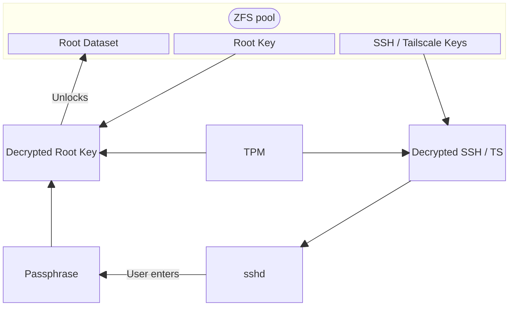

This code is not exactly good. It's a bit of a mess that's thrown
together to make this work. It could be very much improved.

```mermaid
block-beta
  columns 5
  block:pool:5
    columns 3
    space:1
    t(["ZFS pool"])
    space:1
    r["Root Dataset"]
    rvol["Root Key"]
    svol["SSH / Tailscale Keys"]
  end
  space:5
  rkey["Decrypted Root Key"]
  space
  TPM
  space
  skey["Decrypted SSH / TS"]
  rvol --> rkey
  rkey --"Unlocks"--> r
  svol --> skey
  TPM --> skey
  TPM --> rkey
  space:5
  Passphrase
  space
  sshd
  Passphrase --> rkey
  sshd --"User enters"--> Passphrase
  skey --> sshd
```
